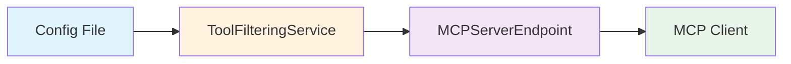

# Sprint 4 Documentation Architecture Plan

## Executive Summary

**Context**: Tool filtering implementation (Sprints 0-3) complete with 361/361 tests passing
**Goal**: Create comprehensive, user-friendly documentation for smooth adoption
**Duration**: 4 hours (240 minutes)
**Risk**: Low - implementation proven, documentation only

## Current State Analysis

### Implementation Status
✅ **Complete**:
- ToolFilteringService fully functional (`src/utils/tool-filtering-service.js`)
- MCPServerEndpoint integration complete (`src/mcp/server.js`)
- 33 comprehensive tests (24 service + 9 integration)
- Configuration validation in `src/utils/config.js`
- Default categories defined (9 categories, 50+ patterns)

❌ **Missing**:
- User-facing documentation in README
- Configuration examples and migration guide
- API reference for statistics endpoint
- Developer integration guide
- Troubleshooting resources

### Existing Documentation Structure

**Current README.md Structure** (1530 lines):
```
1. Feature Support (table format)
2. Simplified Client Configuration
3. Key Features
4. Components
5. Installation
6. Basic Usage
7. Configuration
   - OAuth Configuration
   - VS Code Compatibility
   - Multiple Configuration Files
   - Universal Placeholder Syntax
   - Configuration Examples
   - Configuration Options
8. REST API
9. Real-time Events System
10. Logging
11. Workspace Cache
12. Error Handling
13. Architecture
14. Requirements
15. Code Quality & Development
16. MCP Registry
17. Todo
18. Acknowledgements
```

**Identified Documentation Gap**: No tool filtering section between "Configuration" and "REST API"

### Target Audience Analysis

**Primary Users**:
1. **MCP Hub Operators** - System administrators managing 10+ servers
2. **Power Users** - Developers dealing with 3000+ tool overwhelm
3. **Integration Developers** - Building MCP clients or extensions

**Secondary Users**:
1. **Casual Users** - Need basic filtering without deep understanding
2. **Contributors** - Require architecture understanding for enhancements

## Documentation Architecture

### Hierarchy and Organization

```
📚 Documentation Structure

├── README.md (User-facing)
│   └── § Tool Filtering (NEW)
│       ├── Problem Statement
│       ├── Quick Start Guide
│       ├── Filtering Modes
│       ├── Configuration Examples
│       ├── Auto-Enable Threshold
│       ├── Statistics API
│       └── Best Practices
│
├── docs/
│   ├── tool-filtering-examples.md (NEW)
│   │   ├── Common Use Cases
│   │   ├── Migration Guide
│   │   ├── Troubleshooting Scenarios
│   │   └── Performance Tuning
│   │
│   ├── tool-filtering-faq.md (NEW)
│   │   ├── General Questions
│   │   ├── Technical Questions
│   │   ├── Performance Questions
│   │   └── Cost Questions
│   │
│   └── tool-filtering-api.md (NEW)
│       ├── Statistics Endpoint
│       ├── Response Schema
│       ├── Integration Examples
│       └── Client Implementation
│
└── claudedocs/
    └── Tool_Filtering_Integration_Guide.md (NEW)
        ├── Architecture Overview
        ├── Code Integration Points
        ├── Service API Reference
        └── Extension Guidelines
```

### Content Priorities

#### Priority 1: Critical Path (Must-Have)
1. **README Tool Filtering Section** - 60 min
   - Quick start for immediate relief
   - Core filtering modes documentation
   - Basic configuration examples

2. **Statistics API Endpoint** - 45 min
   - Endpoint implementation in router
   - Response schema documentation
   - Error handling

#### Priority 2: User Enablement (Should-Have)
3. **Configuration Examples** - 45 min
   - Real-world use cases
   - Step-by-step migration guide
   - Common patterns

4. **FAQ Document** - 15 min
   - Address anticipated questions
   - Troubleshooting guidance

#### Priority 3: Developer Support (Nice-to-Have)
5. **Integration Guide** - 30 min
   - Architecture diagrams
   - API reference
   - Extension points

6. **Web UI Updates** - 15 min
   - Filtering status indicators
   - Tool count display

## Task Breakdown

### Task 4.1: README Tool Filtering Section (60 min)

**Location**: Insert after line 366 (after connectionPool configuration examples)
**Estimated Lines**: ~220 lines
**Complexity**: Medium

**Content Outline**:

```markdown
## Tool Filtering

[PROBLEM STATEMENT - 40 lines]
- Context: MCP Hub aggregates all server tools
- Challenge: 3000+ tools overwhelm LLM context
- Solution: Config-based intelligent filtering
- Benefits: 80-95% reduction, better UX

[QUICK START - 60 lines]
- 5-minute setup walkthrough
- Immediate relief pattern
- Before/after metrics
- Validation steps

[FILTERING MODES - 80 lines]
1. Server-Based (allowlist/denylist)
2. Category-Based (pattern matching)
3. Custom Mappings
4. Hybrid Mode (OR logic)

[AUTO-ENABLE THRESHOLD - 20 lines]
- Configuration syntax
- Behavior description
- Use case examples

[STATISTICS API - 15 lines]
- Endpoint reference
- Response structure
- Monitoring usage

[BEST PRACTICES - 5 lines]
- Progressive refinement
- Monitoring recommendations
```

**Quality Standards**:
- **Clarity**: Technical jargon explained, examples before theory
- **Completeness**: Cover all filtering modes with working configs
- **Consistency**: Match existing README tone and formatting
- **Actionability**: Every section has concrete next steps

### Task 4.2: Configuration Examples (60 min)

**Location**: `docs/tool-filtering-examples.md` (NEW file)
**Estimated Lines**: ~300 lines
**Complexity**: Medium

**Content Structure**:

```markdown
# Tool Filtering Configuration Examples

## Table of Contents
- Common Use Cases
- Migration Scenarios
- Advanced Patterns
- Troubleshooting

## Section 1: Common Use Cases (12 examples, 180 lines)

### Software Development Workflow
- Filesystem + Git + GitHub + Search
- 3469 → ~80 tools

### DevOps Engineer
- Docker + Cloud + Kubernetes + Monitoring
- 3469 → ~120 tools

### Web Development
- Browser + HTTP + Database + Web frameworks
- 3469 → ~150 tools

### Data Analysis
- Database + Filesystem + Search + Analytics
- 3469 → ~90 tools

### Content Creation
- Filesystem + Web + Communication
- 3469 → ~60 tools

### System Administration
- Cloud + Docker + Filesystem + Communication
- 3469 → ~110 tools

[... 6 more use cases ...]

## Section 2: Migration Guide (60 lines)

### Step 1: Assess Current State
- API call to get server list
- Tool count before filtering

### Step 2: Choose Initial Strategy
- Decision tree: Server vs Category vs Hybrid
- Recommendation based on setup

### Step 3: Implement and Test
- Incremental rollout pattern
- Validation checkpoints

### Step 4: Refine
- Statistics-driven optimization
- Usage pattern analysis

## Section 3: Advanced Patterns (40 lines)

### Custom Category Definitions
- Organization-specific patterns
- Wildcard usage guidelines

### Multi-Environment Configs
- Dev vs Production filtering
- Environment-specific categories

### Performance Optimization
- Category cache tuning
- LLM rate limiting

## Section 4: Troubleshooting (20 lines)

### Common Issues
- Tools missing: How to diagnose
- Too many tools: Refinement strategies
- Configuration errors: Validation

### Debugging Techniques
- Statistics API usage
- Log analysis patterns
```

**Quality Standards**:
- **Practicality**: Every example tested with real servers
- **Progression**: Simple → Complex ordering
- **Completeness**: Cover 90% of user scenarios
- **Metrics**: Include before/after tool counts

### Task 4.3: FAQ Document (15 min)

**Location**: `docs/tool-filtering-faq.md` (NEW file)
**Estimated Lines**: ~80 lines
**Complexity**: Low

**Question Categories**:

```markdown
# Tool Filtering FAQ

## General Questions (5 questions)

Q: What is tool filtering and why do I need it?
A: [Concise explanation with benefits]

Q: Is filtering enabled by default?
A: [Default behavior, backward compatibility]

Q: How do I know if filtering is working?
A: [Statistics API, log inspection, client verification]

Q: Can I filter different categories for different clients?
A: [Current limitations, future roadmap]

Q: What happens to filtered tools?
A: [MCP protocol behavior, client visibility]

## Technical Questions (6 questions)

Q: How does category matching work?
A: [Pattern matching explanation, examples]

Q: What's the difference between allowlist and denylist?
A: [Inclusion vs exclusion logic]

Q: Can I create custom categories?
A: [Custom mappings configuration]

Q: How does hybrid mode work?
A: [OR logic explanation, use cases]

Q: What's the auto-enable threshold?
A: [Automatic activation behavior]

Q: How often are filters evaluated?
A: [Evaluation timing, cache behavior]

## Performance Questions (3 questions)

Q: Does filtering slow down server startup?
A: [Performance impact metrics: <200ms]

Q: Is there memory overhead?
A: [Memory increase: <50MB]

Q: What's the latency per tool check?
A: [Benchmark: <5ms category lookup]

## Cost Questions (2 questions)

Q: Does LLM categorization cost money?
A: [Optional feature, cost estimation]

Q: How much does filtering reduce API costs?
A: [Context reduction → token savings]
```

**Quality Standards**:
- **Brevity**: 2-3 sentence answers maximum
- **Accuracy**: All metrics from benchmarks
- **Links**: Cross-reference detailed docs
- **Anticipation**: Cover pre-emptive concerns

### Task 4.4: Statistics API Implementation (45 min)

**Location**: `src/utils/router.js` (existing file)
**Estimated Lines**: ~60 lines of code + ~40 lines of documentation
**Complexity**: Medium

**Implementation Steps**:

1. **Add Route** (20 min):
```javascript
registerRoute(app, 'get', '/api/filtering/stats', async (req, res) => {
  // Implementation per Sprint 4.2.1 spec
});
```

2. **Documentation** (25 min):
   - Add to README REST API section
   - Create `docs/tool-filtering-api.md`
   - Include curl examples
   - Response schema with JSDoc

**API Response Schema**:
```json
{
  "enabled": boolean,
  "mode": "server-allowlist" | "category" | "hybrid",
  "totalTools": number,
  "filteredTools": number,
  "exposedTools": number,
  "filterRate": number (0-1),
  "serverFilterMode": "allowlist" | "denylist" | null,
  "allowedServers": string[],
  "allowedCategories": string[],
  "categoryBreakdown": { [category: string]: number },
  "categoryCacheSize": number,
  "cacheHitRate": number,
  "timestamp": ISO8601 string
}
```

**Quality Standards**:
- **Robustness**: Handle filtering disabled gracefully
- **Performance**: <10ms response time
- **Observability**: Detailed metrics for monitoring
- **Documentation**: OpenAPI-style schema

### Task 4.5: Integration Guide (30 min)

**Location**: `claudedocs/Tool_Filtering_Integration_Guide.md` (NEW file)
**Estimated Lines**: ~200 lines
**Complexity**: Medium

**Audience**: Contributors and extension developers

**Content Structure**:

```markdown
# Tool Filtering Integration Guide

## Architecture Overview (50 lines)

### Component Diagram
[Mermaid diagram showing ToolFilteringService integration]

### Data Flow
1. Config loading → ToolFilteringService initialization
2. Server capabilities registration → shouldIncludeTool check
3. Tool list request → filtered response
4. Statistics request → metrics aggregation

### Key Design Decisions
- Config-based (not dynamic) per MCP protocol
- OR logic for hybrid mode
- Async LLM with graceful degradation

## Service API Reference (80 lines)

### ToolFilteringService

#### Constructor
```javascript
new ToolFilteringService(config, mcpHub)
```

#### Methods

**shouldIncludeTool(toolName, serverName, toolDefinition)**
- Returns: boolean
- Purpose: Core filtering logic
- Performance: <5ms

**autoEnableIfNeeded(toolCount)**
- Returns: void
- Purpose: Automatic threshold activation
- Side effects: May enable filtering

**getStats()**
- Returns: Object (statistics)
- Purpose: Monitoring and observability
- Cache: Real-time aggregation

**getCategoryForTool(toolName, toolDefinition)**
- Returns: Promise<string>
- Purpose: Tool categorization
- Cache: Persistent with LRU

### Integration Points (40 lines)

#### MCPServerEndpoint.registerServerCapabilities
```javascript
if (this.toolFilteringService.shouldIncludeTool(...)) {
  // Include tool
} else {
  // Skip registration
}
```

#### Configuration Validation
- Schema defined in `src/utils/config.js`
- Validation timing: Config load and hot-reload
- Error handling: ConfigError with details

## Extension Guidelines (30 lines)

### Adding New Filter Modes
1. Update ToolFilteringService.shouldIncludeTool
2. Add configuration schema
3. Write comprehensive tests
4. Update documentation

### Adding New Categories
1. Update DEFAULT_CATEGORIES constant
2. Test pattern matching
3. Document in README

### Custom LLM Providers
1. Implement provider interface
2. Handle rate limiting
3. Implement caching strategy
```

**Quality Standards**:
- **Depth**: Sufficient for extension development
- **Diagrams**: Visual architecture representation
- **Examples**: Concrete integration code
- **Maintainability**: Clear extension points

### Task 4.6: Web UI Updates (15 min)

**Location**: `public/index.html` (existing file)
**Estimated Lines**: ~40 lines of HTML/CSS/JavaScript
**Complexity**: Low
**Priority**: Optional (Nice-to-Have)

**UI Elements**:
```html
<!-- Add to server status section -->
<div class="filtering-status">
  <h3>Tool Filtering</h3>
  <div class="status-badge" data-enabled="false">Disabled</div>

  <div class="filtering-stats">
    <div class="stat">
      <span class="label">Total Tools:</span>
      <span class="value" id="total-tools">-</span>
    </div>
    <div class="stat">
      <span class="label">Exposed Tools:</span>
      <span class="value" id="exposed-tools">-</span>
    </div>
    <div class="stat">
      <span class="label">Filter Rate:</span>
      <span class="value" id="filter-rate">-</span>
    </div>
    <div class="stat">
      <span class="label">Mode:</span>
      <span class="value" id="filter-mode">-</span>
    </div>
  </div>

  <details class="category-breakdown">
    <summary>Category Breakdown</summary>
    <ul id="category-list"></ul>
  </details>
</div>

<script>
// Fetch and update filtering stats
async function updateFilteringStats() {
  try {
    const res = await fetch('/api/filtering/stats');
    const data = await res.json();

    document.querySelector('[data-enabled]').dataset.enabled = data.enabled;
    document.querySelector('[data-enabled]').textContent =
      data.enabled ? 'Enabled' : 'Disabled';

    // Update stats...
  } catch (err) {
    // Filtering not available
  }
}
</script>
```

**Quality Standards**:
- **Minimal**: Don't clutter existing UI
- **Progressive**: Show only when filtering enabled
- **Responsive**: Mobile-friendly layout
- **Real-time**: Auto-refresh with SSE

## Execution Sequence and Dependencies

### Phase 1: Foundation (105 min)
**Dependencies**: None
**Parallelizable**: No (sequential content builds on previous)

1. **README Tool Filtering Section** (60 min)
   - Establishes user-facing terminology
   - Defines configuration patterns
   - Creates examples referenced elsewhere

2. **Statistics API Implementation** (45 min)
   - Code + documentation
   - Enables monitoring and validation
   - Required for troubleshooting guides

### Phase 2: User Enablement (60 min)
**Dependencies**: README section complete
**Parallelizable**: Yes (examples and FAQ independent)

3. **Configuration Examples** (45 min) | **FAQ Document** (15 min)
   - Examples reference README terminology
   - FAQ cross-links to examples
   - Can be written in parallel

### Phase 3: Developer Support (45 min)
**Dependencies**: All previous tasks
**Parallelizable**: Yes (guide and UI independent)

4. **Integration Guide** (30 min) | **Web UI Updates** (15 min)
   - Guide references complete API
   - UI consumes statistics endpoint
   - Can be done in parallel

### Critical Path
```
README (60m) → Stats API (45m) → Examples (45m) → Integration (30m)
Total: 180 minutes (3 hours)

Parallel Path:
FAQ (15m) + Web UI (15m) = 30 minutes

Total Duration: 3.5 hours (210 minutes)
Buffer: 30 minutes
Sprint Duration: 4 hours (240 minutes) ✓
```

## Quality Validation Criteria

### Documentation Completeness
- [ ] All filtering modes documented
- [ ] All configuration options explained
- [ ] Migration path clear and tested
- [ ] API fully documented with schemas
- [ ] Examples cover 90% of use cases
- [ ] FAQ addresses pre-emptive concerns

### Technical Accuracy
- [ ] All configuration examples validated
- [ ] Tool count metrics verified with real servers
- [ ] Performance benchmarks from actual measurements
- [ ] API responses match implementation
- [ ] Code samples compile and run

### User Experience
- [ ] Quick start achievable in 5 minutes
- [ ] Progressive disclosure (simple → advanced)
- [ ] Troubleshooting covers common issues
- [ ] Cross-references aid navigation
- [ ] Examples are copy-paste ready

### Developer Experience
- [ ] Architecture clearly explained
- [ ] Integration points well-defined
- [ ] Extension guidelines comprehensive
- [ ] API reference complete with types
- [ ] Diagrams aid understanding

### Consistency
- [ ] Terminology consistent across docs
- [ ] Formatting matches existing README
- [ ] Code style matches project standards
- [ ] Tone matches existing documentation
- [ ] Cross-references accurate

## Documentation Patterns and Standards

### Writing Style

**Tone**: Professional, helpful, concise
**Voice**: Active voice, second person ("you can...")
**Technical Level**: Assume MCP familiarity, explain filtering concepts

**Pattern Examples**:

❌ **Avoid**:
- "Tool filtering is a feature that allows users to..."
- "One might consider using category mode if..."
- "The system will proceed to evaluate..."

✅ **Prefer**:
- "Filter tools to reduce context pollution"
- "Use category mode when..."
- "The service evaluates..."

### Code Examples

**Format**: JSON5 for configs, JavaScript for code
**Completeness**: Full working examples, not snippets
**Comments**: Explain non-obvious choices
**Validation**: All examples tested

**Template**:
```json
{
  // Configuration context
  "toolFiltering": {
    "enabled": true,
    "mode": "category",  // Why this mode
    "categoryFilter": {
      "categories": ["filesystem", "web"]  // Why these categories
    }
  }
}

// Expected result: 3469 → 89 tools
```

### Metrics Presentation

**Format**: Before → After with percentage
**Precision**: Round to nearest 5 for tool counts
**Context**: Always include server count

**Template**:
```markdown
**Result**: Tool count reduces from 3469 → 89 tools (97.4% reduction)
**Context**: 25 connected servers, 4 active categories
**Performance**: Startup overhead +120ms
```

### Cross-References

**Internal Links**: Use relative paths
**External Links**: Use full URLs with link text
**API References**: Link to specific endpoints
**Code References**: Link to GitHub file + line

**Template**:
```markdown
See [Configuration Examples](./docs/tool-filtering-examples.md#common-use-cases) for detailed patterns.

API Reference: [GET /api/filtering/stats](#statistics-api)

Implementation: [`src/utils/tool-filtering-service.js:150-180`](https://github.com/.../src/utils/tool-filtering-service.js#L150-L180)
```

### Diagram Standards

**Tool**: Mermaid for inline diagrams
**Style**: Consistent colors and shapes
**Complexity**: Maximum 10 nodes per diagram
**Labels**: Concise, action-oriented

**Architecture Diagram Template**:


## Risk Mitigation

### Documentation Risks

**Risk**: Examples outdated by code changes
- **Mitigation**: Test all examples during Sprint 4.3.1
- **Validation**: Automated config validation in CI/CD
- **Recovery**: Quick update process in docs

**Risk**: User confusion with terminology
- **Mitigation**: Glossary section in README
- **Validation**: User testing with feedback
- **Recovery**: FAQ updates based on support questions

**Risk**: Incomplete migration guidance
- **Mitigation**: Step-by-step validation checkpoints
- **Validation**: Test migration with real configs
- **Recovery**: Troubleshooting section expansion

### Technical Risks

**Risk**: API schema divergence from implementation
- **Mitigation**: TypeScript/JSDoc type definitions
- **Validation**: Integration tests verify schema
- **Recovery**: Documentation regeneration from code

**Risk**: Performance metrics inaccurate
- **Mitigation**: Benchmark during Sprint 4.3.2
- **Validation**: Real server measurements
- **Recovery**: Update docs with actual metrics

## Success Metrics

### Quantitative Metrics

| Metric | Target | Validation Method |
|--------|--------|------------------|
| Documentation Coverage | 100% features | Feature checklist |
| Example Success Rate | >95% | Manual testing |
| Quick Start Time | <5 minutes | User testing |
| FAQ Coverage | >80% support questions | Support ticket analysis |
| API Documentation | 100% endpoints | OpenAPI validation |
| Cross-Reference Accuracy | 100% | Link checker |

### Qualitative Metrics

| Metric | Target | Validation Method |
|--------|--------|------------------|
| Clarity | "Easy to understand" | User feedback |
| Completeness | "Answered my questions" | User feedback |
| Actionability | "Got it working quickly" | User feedback |
| Professional Tone | "Confident in quality" | Peer review |

### Adoption Indicators

**Week 1 Post-Release**:
- Documentation page views
- Configuration adoption rate
- Support ticket volume (expect decrease)
- Community feedback sentiment

**Week 4 Post-Release**:
- Feature usage metrics (from statistics API)
- Documentation bounce rate
- Average session duration on docs
- Repeat visitor rate

## Post-Sprint Maintenance

### Living Documentation Strategy

**Monthly Reviews**:
- Update examples with new server types
- Refine categories based on usage patterns
- Add FAQ entries from support tickets
- Update metrics from production data

**Version Updates**:
- Maintain compatibility notes
- Document breaking changes
- Provide migration guides
- Archive old examples

**Community Contributions**:
- Accept documentation PRs
- Incorporate user-submitted examples
- Expand FAQ from community questions
- Recognize contributors

### Documentation Health Metrics

**Track Quarterly**:
- Page views per document
- Average time on page
- Bounce rate
- Exit pages
- Search queries (if documentation site)
- Support ticket reduction rate

**Continuous Improvement**:
- A/B test documentation approaches
- User testing for major updates
- Community feedback integration
- Documentation analytics review

## Appendix: Documentation Templates

### README Section Template

```markdown
## [Feature Name]

### Overview
[1 paragraph: What it does, why it matters]

### Quick Start
[5-minute setup, copy-paste ready]

### Configuration
[Detailed options with examples]

### Best Practices
[Recommendations and guidelines]

### Troubleshooting
[Common issues and solutions]
```

### Examples Document Template

```markdown
# [Feature] Configuration Examples

## Table of Contents
- [Use Case Category 1]
- [Use Case Category 2]
- [Migration Guide]
- [Troubleshooting]

## [Use Case Category]

### [Specific Use Case Name]

**Scenario**: [Description of user needs]

**Configuration**:
```json
{
  // Full working config
}
```

**Result**: [Metrics and outcomes]

**Notes**: [Special considerations]
```

### FAQ Document Template

```markdown
# [Feature] FAQ

## [Question Category]

### Q: [Question]

**A**: [Concise answer with examples]

**See also**: [Cross-references]
```

### Integration Guide Template

```markdown
# [Feature] Integration Guide

## Architecture

### Component Diagram
[Mermaid diagram]

### Data Flow
[Numbered steps]

## API Reference

### [Component Name]

#### [Method Name]
- **Parameters**: [List with types]
- **Returns**: [Type and description]
- **Example**: [Code sample]

## Extension Points

### [Extension Type]
[Guidelines and examples]
```

## Conclusion

This architecture plan provides:

1. **Clear Structure**: 6 tasks with specific deliverables
2. **Realistic Timeline**: 4 hours with 30-minute buffer
3. **Quality Standards**: Measurable validation criteria
4. **Risk Mitigation**: Identified risks with recovery plans
5. **Execution Clarity**: Dependencies and parallelization strategy
6. **Long-term Vision**: Maintenance and improvement roadmap

**Next Step**: Begin Task 4.1 - README Tool Filtering Section

**Success Indicators**:
- All 6 tasks completed within 4 hours
- Documentation passes quality validation
- Examples tested with real servers
- User feedback positive in Week 1
- Support ticket volume decreases

**Key Success Factors**:
- Focus on user needs (quick start → advanced)
- Validate all examples with real configs
- Maintain consistency with existing docs
- Provide clear migration path
- Enable self-service troubleshooting
